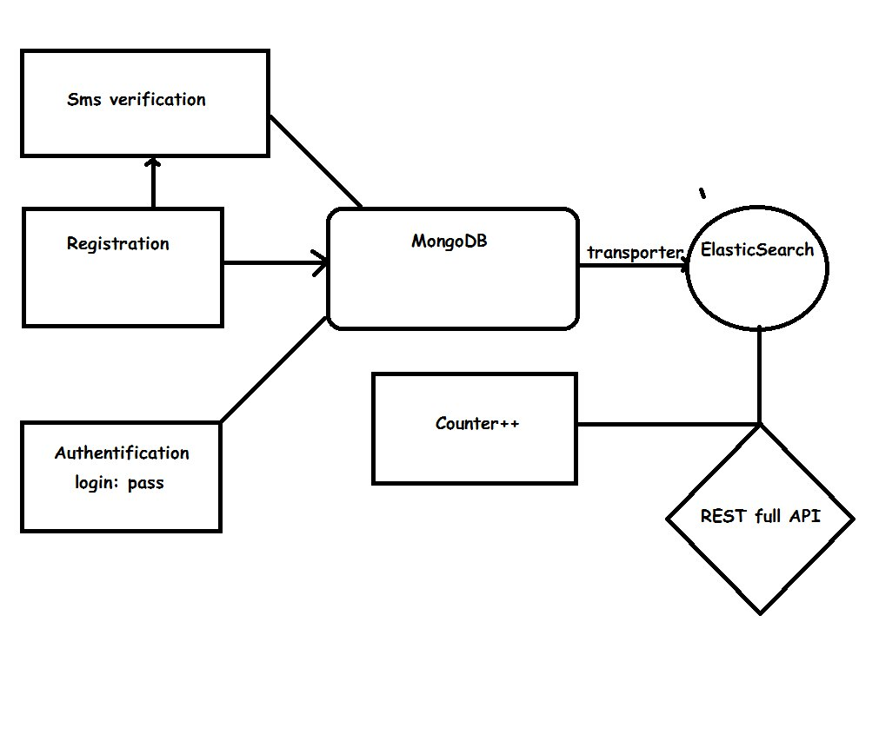

RESTful API для Сбербанка:

https://zelzhan.github.io/sberbank-hackathon/

Использовано:
1. Node.JS
    1. Express
    2. Smsc_api (http://smsc.kz)
    3. Crypto (генерация токенов)
    4. ElasticSearch
    5. mongodb
2. MongoDB, ElasticSearch, Transporter (https://github.com/compose/transporter) как бэкенд
3. Bootstrap, JQuery для фронтенда

Схема:

#### Команда Depressivnie & Smewnie ####
1. Елжан Зейнулла, 1 курс Computer Science, Назарбаев Университет ([@zelzhan](https://github.com/zelzhan))
2. Демежан Мариков, 1 курс Computer Science, Назарбаев Университет ([@ImmortalRabbit](https://github.com/ImmortalRabbit))
3. Даулет Амирханов, 1 курс Computer Science, Назарбаев Университет ( that's [me](https://github.com/daukadolt) :) )
